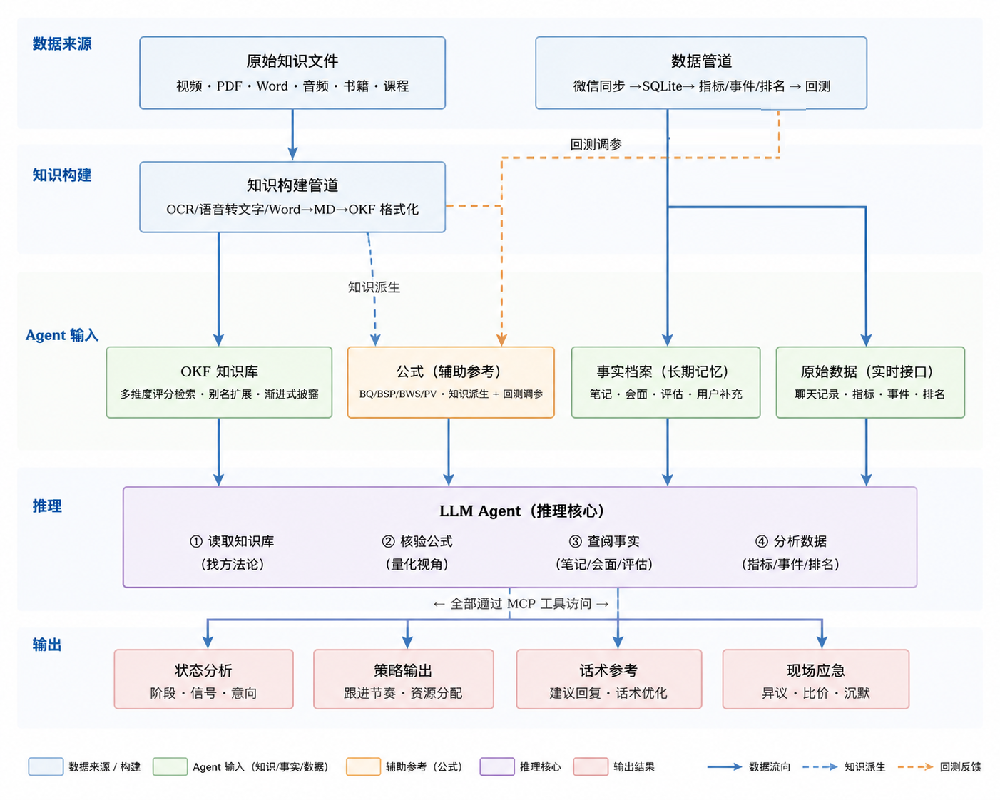

<p align="center">
  
</p>

<h1 align="center">SalesCRM</h1>

<p align="center">
  <em>AI 驱动的本地微信销售客户分析助手</em>
</p>

<p align="center">
  
  
  
  
  
</p>

<p align="center">
  <strong>数据自动同步 · 客户意向量化 · 销售时机识别 · Agent 推理决策</strong>
  <br><br>
  <b>代码负责数据，Agent 负责推理。</b>
</p>

---

## 目录

- [为什么需要 SalesCRM](#为什么需要-salescrm)
- [功能特性](#功能特性)
- [快速开始](#快速开始)
- [架构设计](#架构设计)
- [工具系统](#工具系统)
- [对比](#对比)
- [项目结构](#项目结构)
- [文档索引](#文档索引)
- [License](#license)

---

## 为什么需要 SalesCRM

销售每天在微信上和几十上百个客户沟通，普遍面临三个问题：

| 问题 | 后果 |
|------|------|
| 客户多了记不住进度 | 全靠大脑和 Excel，客户跟到哪一步全靠回忆 |
| 不知道先跟进谁 | 没有优先级判断，经常在不该花时间的客户身上耗着 |
| 聊天信号看不全 | 客户发出了购买意向、竞品威胁、决策节点，人工根本筛不完 |

**SalesCRM 做的事：** 自动同步微信聊天记录 → 量化客户意向 → 结合销售知识库推理 → 生成跟进建议。

**不做的：** 不是群发工具、不是公司级 CRM 替代品、不需要手动填数据。

---

## 功能特性

### 数据自动同步

从微信自动拉取联系人、消息和朋友圈数据，无需手动录入。支持两种后端：

| 后端 | 原理 | 优势 | 局限 |
|------|------|------|------|
| **WCD** ([WeChatDataAnalysis](https://github.com/LifeArchiveProject/WeChatDataAnalysis)) | 解密微信本地 SQLite 数据库 | 数据完整、支持朋友圈 | 需 Windows + 解密环境 |
| **WeFlow** ([WeFlow](https://github.com/hicccc77/WeFlow)) | HTTP API 拉取 | 跨平台、部署简单 | 功能相对受限 |

同步特性：
- 增量同步（默认），基于 watermark 避免重复拉取
- 按人同步（`sync_person`），分析单个客户前快速刷新
- 朋友圈互动同步
- checkpoint 断点续传

### 客户身份目录

Person → Account → Alias 三层映射，解决微信场景下最头痛的身份问题：

```
Person (自然人)
  └── Account (微信号 A) ── Aliases: 昵称 A / 备注 A / 手动别名
  └── Account (微信号 B) ── Aliases: 昵称 B / 备注 B
```

- 一个客户可以有多个微信账号
- 模糊搜索任意昵称、备注、wxid 都能定位
- 自动从联系人列表 bootstrapping 初始化
- 支持账号绑定、别名管理、重复合并

### 15 维量化指标

| 类别 | 指标 | 含义 |
|------|------|------|
| **互动** | `fback` / `rlatency` | 回复字数比 / 速度比 |
| **质量** | `fback_quality` / `qscore_personal` | 回复质量 / 个性化问题 |
| **情绪** | `escore` / `escore_volatility` | 情绪表达 / 情绪波动 |
| **活跃** | `recent` / `active_days` / `msg_count` | 最后活跃 / 活跃天数 / 消息量 |
| **朋友圈** | `moments` | 朋友圈互动频率 |
| **趋势** | `trend` / `msg_volume_trend` / `latency_trend` | 周变化趋势 |
| **惩罚** | `neediness_penalty` | 消息占比过高时降权 |

输出意向等级：**强意向** ≥ 0.70 / **中意向** ≥ 0.50 / **弱意向** ≥ 0.30 / **冷淡** ≥ 0.15 / **无信号** < 0.15

互动模式：`buyer`（买方） / `evaluator`（评估者） / `free_consulting`（白嫖） / `silent`（沉默）

### 事件检测

自动识别销售关键节点：

| 事件 | 含义 |
|------|------|
| `FIRST_CHAT` | 首次聊天 |
| `DISCONNECT` | 连续 N 天无消息 |
| `RECONNECT` | 断联后恢复 |
| `FREQUENCY_UP/DOWN` | 消息频率变化 |
| `REQUIREMENT_CONFIRM` | 需求确认信号 |
| `DECISION_MAKER_APPEAR` | 决策人出现 |
| `PROPOSAL_SENT` | 方案或报价发送 |

### Wiki 知识库（推理主轴）

内置 **OKF 格式** 销售知识库（78 entities + 14 scenarios），涵盖：

- **方法论框架**：SPIN 销售法、MEDDIC、价格异议应对、需求确认
- **客户心理学**：沉默客户激活、频率法则、建立信任
- **谈判技巧**：异议处理、报价时机、竞品应对
- **场景策略**：首次接触、方案展示、逼单、售后复购

**关键设计：** Wiki 是 Agent 的推理主轴，不是参考材料。Agent 先检索方法论再分析数据，每个判断引用 Wiki 条目作为依据。

### 辅助参考公式

通用战态和销售专属两套公式，为 Agent 提供量化视角：

| 体系 | 公式 | 用途 |
|------|------|------|
| **通用战态** | IVI / SPE / EWS / IS / Gap_Effect / EEV / CS / Action | 关系量化分析 |
| **销售专属** | BQ / BSP / BWS / PV / Action | 销售决策辅助 |

公式是 **辅助参考**，不机械套阈值。Agent 核验公式结果，最终判断以 Wiki 方法论 + 事实档案为准。

### MCP 服务器

55 个工具通过 [FastMCP](https://github.com/jlowin/fastmcp) stdio 协议暴露，兼容 Claude Desktop、Cursor 等 AI 客户端：

- **23 只读** — brief / chat / metrics / rank / wiki_search 等
- **17 写入** — note / date / evaluate / save_analysis 等
- **15 公式** — IVI / SPE / BQ / BSP / BWS 等

AI 可直接驱动完整分析工作流。

---

## 快速开始

### 环境要求

- Python 3.10+
- 数据后端（二选一）：
  - [WCD (WeChatDataAnalysis)](https://github.com/LifeArchiveProject/WeChatDataAnalysis) — Windows，需解密环境
  - [WeFlow](https://github.com/hicccc77/WeFlow) — 跨平台，轻量部署

### 安装

```bash
# 1. 克隆仓库
git clone https://github.com/your-username/SalesCRM.git
cd SalesCRM

# 2. 安装依赖
pip install pyyaml

# 3. 初始化数据库
python -c "from engine.importers.db_init import init_db; init_db()"
```

### 配置

编辑 `data/system/config.yaml`，设置数据后端：

```yaml
weflow:
  backend: wcd                    # wcd 或 weflow
  base_url: "http://127.0.0.1:10392"  # 后端地址
  token: "your_token_here"        # API token
```

### 同步数据

```bash
# 全量同步（首次使用）
python -c "from engine.tools import sync; sync(mode='full')"

# 同步单个客户（分析前快速刷新）
python -c "from engine.tools import sync_person; sync_person('客户名')"

# 查看客户排名
python -c "from engine.tools import rank; print(rank())"

# 查看客户概览
python -c "from engine.tools import brief; print(brief('客户名', compact=True))"
```

### 启动 MCP 服务器（可选）

```bash
python -m mcp_server.server
```

接入 Claude Desktop 等 AI 客户端后，Agent 可直接完成分析、判断、记录。

### 常用操作速查

```python
from engine.tools import sync_person, brief, chat, metrics, rank
from engine.tools import wiki_search, note, date, events

# 分析客户流程
sync_person("张三")
overview = brief("张三", compact=True)     # 概览
history = chat("张三", recent=100)          # 最近聊天
m = metrics("张三")                          # 指标
wiki_search("需求确认 销售技巧")              # 查方法论

# 记录事实
note("张三", "客户提到预算审批需要老板确认")
date("张三", date_text="2026-07-06", location="线上演示", rating=4)

# 检测事件
events("张三", scan=True)
```

---

## 架构设计

### 核心原则

**代码负责数据，Agent 负责推理。**

系统提供完整的数据采集、指标计算、事实存储管线，而分析和决策全部交给 AI Agent。代码层不写死任何业务逻辑，Agent 参考 Wiki 方法论 + 量化指标 + 事实档案做综合判断。

### 完整数据流

```text
微信客户端
    │
    ▼  WCD / WeFlow HTTP API
┌──────────────────────────────────────────────────┐
│              importers/ (同步管道)                 │
│   sync_messages / sync_contacts / sync_moments    │
└──────────────────────┬───────────────────────────┘
                       │
                       ▼
┌──────────────────────────────────────────────────┐
│           core.db (SQLite 本地数据库)              │
│   messages / contacts / moments / sync_state     │
└──────────────────────┬───────────────────────────┘
                       │
                       ▼
┌──────────────────────────────────────────────────┐
│              analyzers/ (分析引擎)                 │
│   15 维指标 · 事件检测 · 排名 · 周报              │
└──────────────────────┬───────────────────────────┘
                       │
                       ▼
┌──────────────────────────────────────────────────┐
│          Agent 工具层 (engine/tools.py)           │
│   包装所有数据操作，禁止直接查数据库               │
└──────────────────────┬───────────────────────────┘
                       │
                       ▼
┌──────────────────────────────────────────────────┐
│               Agent 推理循环                      │
│                                                   │
│   ① 读 Wiki 找方法论框架                          │
│      └─ 搜索 SPIN、MEDDIC、价格异议等             │
│                                                   │
│   ② 查事实档案了解历史                            │
│      └─ 读取客户 facts + 历史分析结论              │
│                                                   │
│   ③ 看实时聊天和指标                             │
│      └─ brief / chat / metrics / status           │
│                                                   │
│   ④ 核验公式获取量化参考                          │
│      └─ BQ / BSP / BWS / PV / sales_action        │
└───────────────────────────────────────────────────┘
```

### 身份解析流程

```text
输入: "张三"
    │
    ▼
engine/identity/directory.py
    │
    ├─ ① 精确匹配 (person_id / wxid)
    ├─ ② 别名匹配 (contact_aliases.value_norm)
    ├─ ③ 模糊搜索 (display_name / remark / nickname)
    └─ ④ 最佳匹配排序 (按编辑距离 + 别名权重)
    │
    ▼
输出: Person 对象 (含全部 account + alias)
```

### 辅助公式体系

公式源自 chat-skills 遗产，通过标注 Wiki 依据做软关联：

```text
┌────────────────────────────────────────────┐
│              公式 (辅助参考)                  │
│                                              │
│  通用战态                                    │
│  ├─ IVI = f(sp, fback, investment, pface)   │
│  ├─ SPE = f(user_dd, target_dd, latency)    │
│  ├─ EWS = f(gap_effect, cp, eev, scarcity)  │
│  └─ Action: push / pull / reset / maintain  │
│                                              │
│  销售专属                                    │
│  ├─ BQ  = f(sp, fback, investment, pface)   │
│  ├─ BSP = f(user_dd, target_dd, latency)    │
│  ├─ BWS = f(gap_effect, cp, eev, scarcity)  │
│  ├─ PV  = f(p_succ, bonus, p_fail, risk)    │
│  └─ Action: bargain / push / nurture / ...   │
│                                              │
│  标注 Wiki 依据做软关联，不机械套阈值         │
└────────────────────────────────────────────┘
```

---

## 工具系统

所有数据操作必须通过 `engine/tools.py`，禁止直接查询数据库。

### 数据读取（只读）

```python
from engine.tools import brief, chat, evidence, metrics, status, rank
from engine.tools import wiki_search, wiki_show, moments_stats
```

| 工具 | 返回 | 用途 |
|------|------|------|
| `brief(name)` | Markdown | 客户全局视图：事实 + 指标 + 事件 + 信号 |
| `chat(name, recent=100)` | Markdown | 聊天记录，已标注双方身份 |
| `evidence(name, section)` | Markdown | 事实档案（notes / dates / timeline） |
| `metrics(name)` | dict | 15 维指标 + 互动模式 |
| `status(name)` | Markdown | 格式化指标状态表 |
| `rank()` | Markdown | 全部联系人排名 |
| `wiki_search(query)` | Markdown | 跨 Wiki / 分析 / KB 搜索 |

### 数据写入

```python
from engine.tools import note, date, evaluate, events
from engine.tools import save_analysis, save_from_markdown
```

| 工具 | 用途 | 权限 |
|------|------|------|
| `note(name, text)` | 添加备注 | 直接执行 |
| `date(name, ...)` | 记录会面/演示/沟通 | 直接执行 |
| `evaluate(name, text)` | 记录主观评估 | 直接执行 |
| `events(name, scan=True)` | 检测并写入事件 | 建议先 scan 预览 |
| `save_analysis(name, ...)` | 保存分析结论（YAML） | 覆盖前告知用户 |
| `save_from_markdown(name, text)` | 保存 Markdown 报告 | 覆盖前告知用户 |

### 身份与同步

```python
from engine.tools import contact, exclude, failure
from engine.tools import sync, sync_person, sync_moments, weekly
```

| 工具 | 用途 |
|------|------|
| `contact(query, action)` | 身份查询 / 别名管理 / 账号绑定 / 合并 |
| `exclude(action)` | 排除列表管理 |
| `failure(action)` | 失败案例管理 |
| `sync(mode='incremental')` | 全量/增量数据同步 |
| `sync_person(name)` | 按人增量同步 |
| `weekly()` | 生成周报 |

---

## 对比

| 维度 | SalesCRM | 传统 CRM (Salesforce 等) | WeTool / 微伴 |
|------|----------|------------------------|---------------|
| 数据来源 | 微信自动同步 | 手动录入 | 微信群发 |
| 意向量化 | 15 维指标 + 公式 + Agent 推理 | 销售自己填 | 无 |
| 销售方法论 | 内置 Wiki 知识库（78 entities） | 无内置 | 无 |
| 自动化程度 | 增量同步 + AI 自动分析 | 全靠人维护 | 群发/拉群 |
| 数据安全 | **全本地** | 上云 | 上云 |
| 团队协作 | 暂无 | 完整 | 基础 |
| 部署成本 | 本地搭环境，0 费用 | 付费订阅 | 付费订阅 |
| 对接微信 | 原生支持 | 不支持 | 官方接口 |

---

## 项目结构

```text
SalesCRM/
│
├── engine/                         # 核心引擎
│   ├── tools.py                    # Agent 工具统一入口
│   ├── config.py                   # 配置管理与路径常量
│   ├── formulas.py                 # 通用战态公式 (IVI/SPE/EWS)
│   ├── formulas_sales.py           # 销售专属公式 (BQ/BSP/BWS/PV)
│   ├── formulas_love.py            # 情感战态公式
│   │
│   ├── agent/                      # Agent 工具实现
│   │   ├── core.py                 # 共享基础设施
│   │   ├── brief.py / chat.py      # 数据读取
│   │   ├── write.py / evidence.py  # 数据写入与档案
│   │   ├── report.py / signals.py  # 报告与信号
│   │   ├── identity_ops.py         # 身份操作
│   │   ├── sync_agent.py           # 同步入口
│   │   ├── material.py             # 知识搜索
│   │   ├── maintain.py             # 客户维护
│   │   └── context.py              # 上下文组装
│   │
│   ├── analyzers/                  # 分析引擎
│   │   ├── metrics.py              # 15 维指标
│   │   ├── ranker.py               # 客户排序
│   │   ├── events.py               # 事件检测
│   │   └── weekly_report.py        # 周报生成
│   │
│   ├── identity/                   # 身份目录
│   │   └── directory.py            # Person→Account→Alias 解析
│   │
│   ├── facts/                      # 事实档案
│   │   ├── people_archive.py       # 客户事实档案
│   │   └── failure_archive.py      # 失败案例
│   │
│   ├── importers/                  # 同步管道
│   │   ├── sync.py                 # 同步调度
│   │   ├── wcd_client.py           # WCD 后端客户端
│   │   ├── weflow_client.py        # WeFlow 后端客户端
│   │   └── db_init.py              # 数据库初始化
│   │
│   └── knowledge/                  # Wiki 知识库检索
│       └── wiki_retriever.py       # 五维度评分检索
│
├── mcp_server/                     # MCP 服务器
│   ├── server.py                   # FastMCP 入口
│   ├── tools_read.py               # 只读工具注册
│   ├── tools_write.py              # 写入工具注册
│   ├── tools_formula.py            # 公式工具注册
│   ├── tools_guide.py              # 工作流指南
│   └── tests/                      # 集成测试
│
├── readme/                         # 模块文档
├── tests/                          # 单元测试
├── docs/wiki/                      # 销售知识库 (独立仓库)
├── data/                           # 本地数据 (.gitignored)
└── 架构图.png                      # 架构示意图
```

---

## 文档索引

| 文档 | 说明 |
|------|------|
| [PROJECT.md](readme/PROJECT.md) | 项目总览、功能清单、工具契约、工作流、风险 |
| [agent.md](readme/agent.md) | Agent 工具层实现细节与模块划分 |
| [analyzers.md](readme/analyzers.md) | 指标引擎、排名算法、事件检测 |
| [identity.md](readme/identity.md) | 身份目录三层映射与解析流程 |
| [facts.md](readme/facts.md) | 事实档案结构与分层设计 |
| [importers.md](readme/importers.md) | 数据同步管道与后端对接 |
| [formulas.md](readme/formulas.md) | 辅助参考公式体系与演进链条 |
| [knowledge.md](readme/knowledge.md) | Wiki 知识库检索与渐进披露 |
| [mcp.md](readme/mcp.md) | MCP 服务器工具清单与设计 |
| [models.md](readme/models.md) | 数据模型定义 |
| [tools.md](readme/tools.md) | 工具函数签名与速查表 |

---

## License

[MIT](LICENSE)
